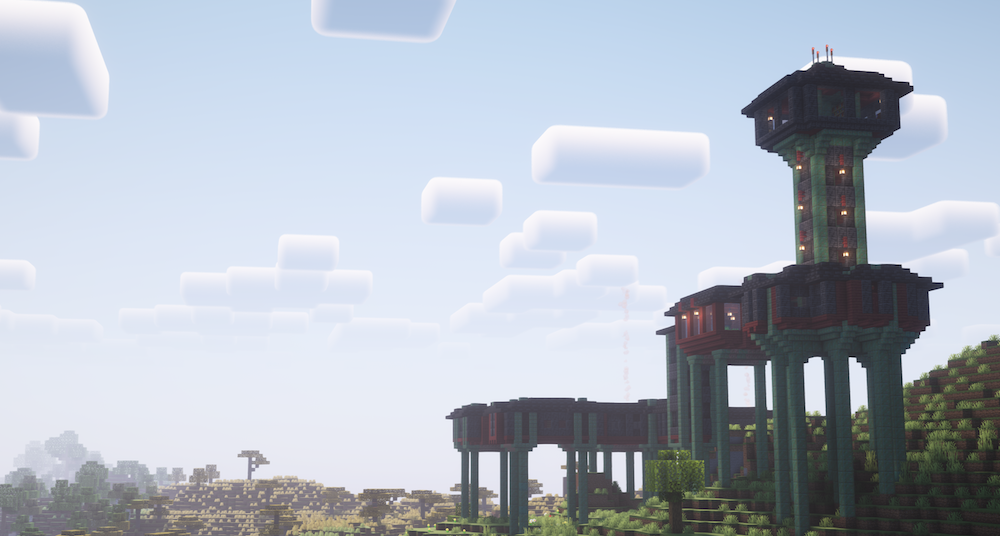
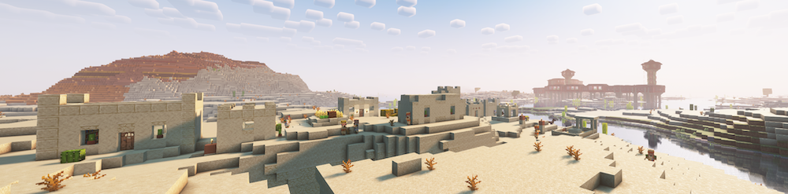
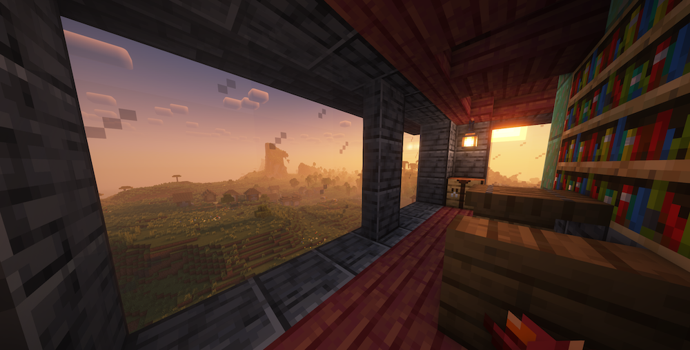
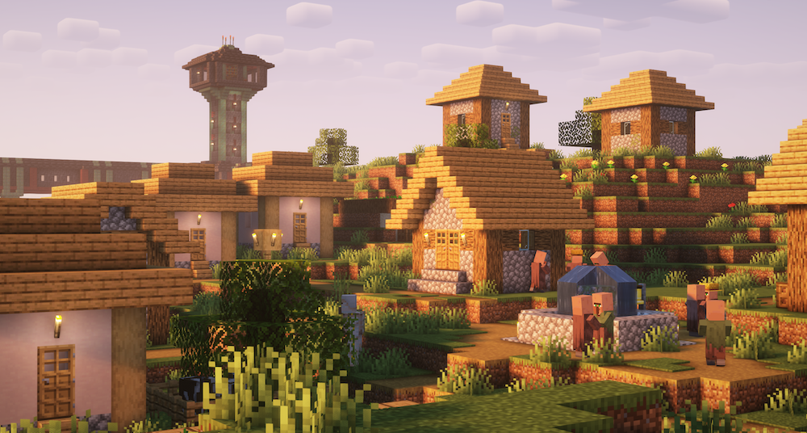

# GDMC 2023
Submission by Niels-NTG for the [2023 Generative Design in Minecraft AI Settlement Generation Challenge](https://gendesignmc.wikidot.com/wiki:2023-settlement-generation-competition).

In this competition participants design and implement an algorithm that constructs a settlement in Minecraft. Submissions are judged on the aesthetics and narrative qualities of the output, on how functional the structure is from a gameplay perspective, and how well it adapts to any arbitrary Minecraft landscape.

## Field Lab Gamma γ
Field Lab Gamma is a mysterious scientific research station that suddenly just appeared into the world. Where did it come from? Who were the staff? What were they looking for and where have they gone to?

### Setup
This script works combined with the [HTTP Interface Forge mod](https://github.com/Niels-NTG/gdmc_http_interface/) for Minecraft 1.19.2. The generator itself is written for Python 3.10 and requires the packages listed in `requirements.txt`. Also don't forget to run `git submodule update --init` to install the `MCTS` and `gdpc` packages. Start the generator by running `main.py`, no CLI arguments required. The structures will be placed somewhere within build area, this can be set by setting the buidarea by running `/setbuiltarea fromX fromY fromZ toX toY toZ` in Minecraft itself before running the generator.

### Method

#### Pre-built structures

The generator is primarily designed around placing discrete pre-build structures into the world. Each structure is designed by hand to dynamically adapt to the terrain, connect to other adjacent structures and have custom properties if needed. Each is implemented as one or more NBT files that contain the actual Minecraft block data and a Python file that orchestrates the construction cost calculation, list possible adjacent structures, placement and pre- and post-processing steps for that type of structure. See [`StructureBase.py`](./StructureBase.py) for the base class.

#### MCTS

To decided where and what to build, this generator uses [Monte Carlo Tree Search (MCTS)](https://en.wikipedia.org/wiki/Monte_Carlo_tree_search). Each *node* in the tree $a$ is assigned a type of structure and construction cost by the action $a$ taken from the parent node.

When running the search, it starts constructing a tree of nodes starting a pre-constructed root node. For its rollout policy (also known as tree policy), it randomly selects actions weighted by the cost of doing this action. Actions with a cost of less than 0 are not considered. For example, an action resulting in structure being build very high above the ground has a much lower likelihood of being chosen by this policy compared to a structure that keeps very close to the ground because the cost of constructing support pillars contribute less to the cost.

To guide the search, nodes have a reward function that calculate how close its state is to the goal. In the case of [`DebugSettlement.py`](./settlement/DebugSettlement.py) the reward function is rather simple: distance to a position in the world. When selecting and expanding the tree, the search algorithm favours structures that are cheaper to build. In the subsequent simulation phase.
